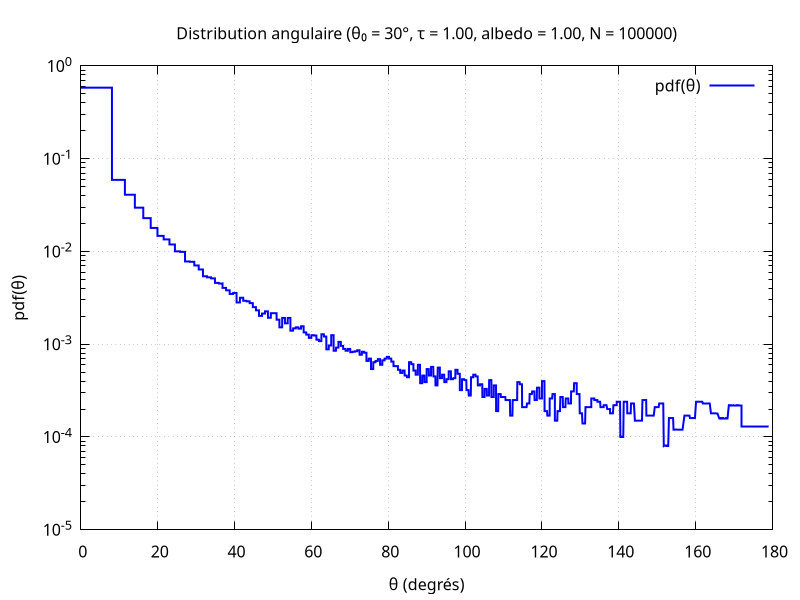
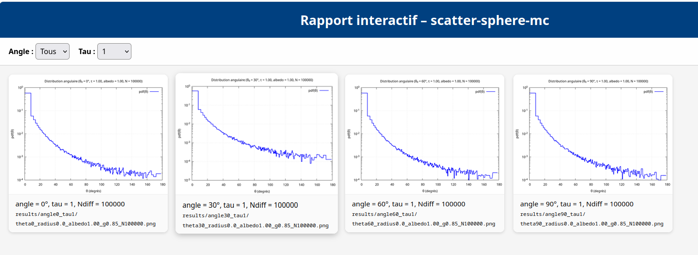

# ScatterSphereMC — Monte Carlo Radiative Transport Simulator


**ScatterSphereMC** est un simulateur Monte‑Carlo robuste et scientifiquement validé pour le transport radiatif dans une **sphère diffusante homogène**.  
Il est conçu pour être **simple**, **lisible**, **physiquement correct**, **reproductible**, et **pédagogique**.

---

# 🚀 Quick Start

### 1. Construire toutes les images Docker
```bash
./build.sh
```

### 2. Lancer une simulation simple (simulate → tri → plot)
```bash
./run.sh
```

### 3. Résultat
Le fichier PNG est généré dans :

```
results/output.png
```

---

# 📊 Exemple de résultat



Ce rendu est produit automatiquement par le pipeline complet :

```
simulate → tri → plot
```

La distribution angulaire obtenue correspond à une diffusion Henyey–Greenstein dans une géométrie sphérique.

---

# 🧠 Fonctionnalités principales

- moteur Monte‑Carlo performant et non biaisé  
- géométrie sphérique analytique  
- diffusion Henyey–Greenstein  
- RNG reproductible (uint64 → double IEEE754)  
- pipeline complet : **simulate → tri → plot**  
- export CSV + gnuplot  
- 46 tests unitaires  
- CI GitHub Actions moderne : cppcheck, scan-build, clang‑tidy, valgrind  
- images Docker dédiées : simulate, plot, tests  
- CD local basé sur k0s : pipeline Kubernetes local  
- **pipeline multi‑paramètres (`sweep.sh`)**  
- **rapport HTML interactif avec zoom plein écran**  
- **affichage du nombre de photons diffusés (mesure du bruit MC)**  

---

# 🔍 Analyse du bruit Monte‑Carlo

Chaque simulation exporte un fichier :

```
results/angleXX_tauYY/stats.txt
```

contenant :

- **le nombre de photons diffusés au moins une fois**  
  (critère physique du bruit MC)

Ce nombre est affiché automatiquement dans le **rapport interactif**.

---

# 🌐 Rapport HTML interactif

Génération :

```bash
./generate_report_interactive.sh
```

Fonctionnalités :

- filtres dynamiques (angle, tau)  
- affichage du nombre de photons diffusés  
- zoom plein écran sur chaque graphe  
- galerie responsive  
- mode clair/sombre automatique  

Le rapport est généré dans :

```
report_interactif.html
```




---

# ⚙️ Dépendances sur la machine hôte

Aucune dépendance scientifique n’est requise.

L’hôte n’a besoin que de :

- Docker / Podman / nerdctl  
- Bash  
- utilitaires GNU standard (`awk`, `sed`, `find`, `sort`, `grep`, `date`)  

Pour le CD local via k0s, il faut également :

- `kubectl`  
- `envsubst`  
- `k0s` ou `ctr`

Toutes les bibliothèques scientifiques sont embarquées dans les images Docker.

---

# 🐳 Images Docker

### ✔️ `scatter-sphere:simulate`
- moteur Monte‑Carlo  
- export CSV  
- toolchain GCC Fedora

### ✔️ `scatter-sphere:plot`
- gnuplot  
- génération PNG autonome

### ✔️ `scatter-sphere:test`
- libcmocka  
- tests unitaires  
- valgrind intégré

---

# 🧪 Tests unitaires

Exécution :

```bash
docker run --rm scatter-sphere:test
```

Couverture :

- géométrie sphérique  
- diffusion HG  
- RNG et reproductibilité  
- conservation de l’énergie  
- distributions analytiques  
- stabilité numérique  
- export CSV  
- performance

---

# 🧬 Validation scientifique

Le code est validé par :

- conservation stricte de l’énergie  
- comparaison à la distribution analytique Henyey–Greenstein  
- validation de la distribution radiale  
- reproductibilité du RNG  
- tests de stabilité numérique  
- tests Monte‑Carlo sur 46 cas unitaires

---

# ⚡ Performance

- 1 million de photons simulés en ~0.3 s sur CPU moderne  
- RNG vectorisable  
- code C optimisé (`-O3`)  
- géométrie analytique → pas de racines cubiques ou intersections complexes  

---

# 🧩 Architecture du projet

```
.
├── analyse_diff.py
├── build.sh
├── config.template.toml
├── config.toml
├── deploy.sh
├── Dockerfile.plot
├── Dockerfile.simulate
├── Dockerfile.tests
├── example1.png
├── example2.png
├── generate_report_interactive.sh
├── Makefile
├── README.md
├── report_interactif.css
├── report_interactif.js
├── run.sh
├── run_many.sh
├── run_one.sh
├── src/
│   ├── basis.c
│   ├── config.c
│   ├── geometry.c
│   ├── hg.c
│   ├── plot_csv.c
│   ├── plot_gnuplot.c
│   ├── plot_main.c
│   ├── plot_utils.c
│   ├── rng.c
│   ├── simulate.c
│   └── vec3.c
├── tests/
│   ├── test_angular_moment.c
│   ├── test_basis.c
│   ├── test_config.c
│   ├── test_conservation.c
│   ├── test_convergence.c
│   ├── test_depth_distribution.c
│   ├── test_distance_to_sphere.c
│   ├── test_flux_angular.c
│   ├── test_flux_radial.c
│   ├── test_hg.c
│   ├── test_hg_stats.c
│   ├── test_initial_direction.c
│   ├── test_interaction_count.c
│   ├── test_main.c
│   ├── test_path_length.c
│   ├── test_performance.c
│   ├── test_plot_csv.c
│   ├── test_plot_gnuplot.c
│   ├── test_plot_utils.c
│   ├── test_rng.c
│   ├── test_roulette.c
│   ├── test_simulate.c
│   ├── test_stability.c
│   ├── test_variance_mc.c
│   └── test_vec3.c
├── .github/
│   └── workflows/ci.yaml
└── k8s/
    └── job.yaml.template
```

---

# ☸️ Pipeline Kubernetes (k0s) — CD local

Déploiement local via k0s :

```bash
./deploy.sh
```

Fonctionnalités :

- build automatique de l’image simulate  
- import dans containerd  
- exécution d’un Job Kubernetes  
- récupération automatique du CSV  
- résumé automatique  
- historique local (`runs.log`)

---

# 🔐 SELinux (Fedora)

Les montages nécessitent `:Z` :

```
-v "$(pwd)/results:/app/results:Z"
-v "$(pwd)/config.toml:/app/results/config.toml:ro,Z"
```

---

# 📘 Exemple de configuration (`config.toml`)

```toml
n_photons = 100000
sigma_e = 50.0
albedo = 0.9
g = 0.85
radius = 1.0
n_mu_bins = 200
seed = 42
theta_zero = 30
```

---

# 🛣️ Roadmap

- support multi‑couches  
- modèle Mie simplifié  
- support OpenMP  
- histogrammes 2D (θ, φ)  
- interface Web minimaliste  
- packaging Podman Desktop  

---

# 📄 Licence

MIT — libre, modifiable, réutilisable.

---

# ❤️ Remerciements

Merci à la physique du transport radiatif, aux méthodes Monte‑Carlo, et à la rigueur scientifique qui rendent ce projet passionnant.
